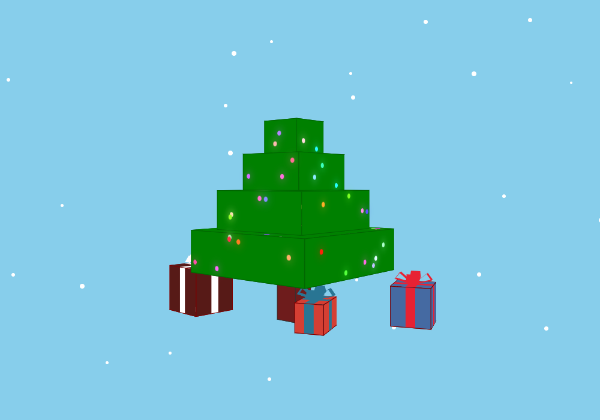

# 3D Tree

This is a 3D Christmas tree scene built purely with vanilla HTML, CSS, and JS.
No libraries—just the raw power of CSS 3D transforms.

The scene can be rotated with the arrow keys. For simplicity, responsiveness is limited, and larger devices work best.

You can try it out here: https://techpandapro.github.io/3d-tree/

If you're interested in learning how these 3D transforms work, I'd recommend starting by trying to create a 3D cube with CSS. There are some terrific tutorials online!

The range of what you scenes you can create with 3D CSS is, admittedly, fairly limited—as is their practicality. This scene is built from many `div` elements rotated in 3D space, hence the scene's "boxy" appearance. For rounded objects/edges, you would have to compose the rounded portions from a multitude of rectangular `div`s. Adding shadowing would also add a fair bit of complexity. This is why the scene instead takes on a relatively simplistic appearance.

(For many use cases, you could perhaps create an illusion with other techniques, such as gradients, but I personally wanted the scene to be able to rotate in 3D space without being more complicated than it already is. The concept is simple, but the code is extensive!)
